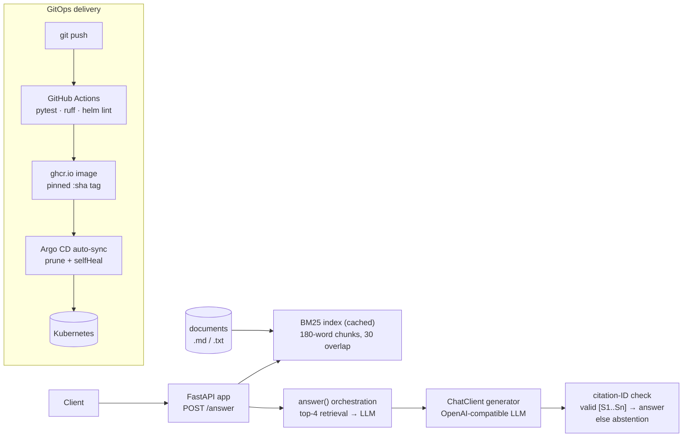

# Evidence RAG

[Architecture](#architecture) · [Measured results](#measured-results) · [Setup](#setup) ·
[Usage](#usage) · [API reference](#api-reference) · [Deployment](#deployment) ·
[Project structure](#project-structure) · [CI status](#ci-status) ·
[docs/architecture.md](docs/architecture.md) · [docs/operations.md](docs/operations.md) ·
[Helm chart](k8s/helm/evidence-rag-service/) · [Argo CD application](k8s/argocd/application.yaml)

A FastAPI service for **evidence-first retrieval-augmented generation**: it
chunks operator-provided documents, retrieves passages with BM25, generates an
answer from an OpenAI-compatible model, and **validates citation IDs** — any
response without valid `[S1]…[Sn]` citations is replaced with an abstention. It
is a reference implementation — it has not been deployed to a production
cluster.

## Architecture



Full design notes live in [docs/architecture.md](docs/architecture.md) and
[docs/operations.md](docs/operations.md). Key guarantees (enforced by
`src/service/rag.py` and covered by tests):

- **Chunked BM25 retrieval.** `load_documents` chunks `.md`/`.txt` files into
  180-word windows with 30-word overlap; `BM25Index.search` returns the top-4
  scored passages.
- **Citation-ID validation, not factuality.** `answer` extracts `[S1]…[Sn]` from
  the generated text and checks they are non-empty and within the retrieved
  passage range; invalid or missing IDs produce
  `"I could not verify a cited answer from the retrieved sources."`
- **Cached index.** `index()` is built once per process (`lru_cache`) from
  `DOCUMENT_ROOT`; readiness fails on an empty or missing directory.
- **Source passages are data.** The generator system prompt treats retrieved
  text as data, not instructions, and forbids inventing citations.

## Measured results

All numbers below were measured by running the repo's own code on 2026-09-23
(local machine, uvicorn on loopback, synthetic reference documents — not
production traffic). The service is a reference implementation; these are
engineering measurements, not business claims.

| What | Result | How measured |
|---|---|---|
| Test suite | 4 passed, 0 failed | `python -m pytest -q` |
| Lint | clean | `ruff check .` |
| `POST /answer` latency (p50) | 7.3 ms | n=200 sequential requests, local uvicorn |
| `POST /answer` latency (p95) | 28.1 ms | same run (max 334.5 ms single outlier) |
| Helm chart | `helm lint --strict` passes; `helm template` renders (default and `autoscaling.enabled=true,networkPolicy.enabled=true` variants); rendered manifests pass client-side structural validation | helm v3, 2026-09-23 |

Latency setup: `DOCUMENT_ROOT` pointed at two small synthetic documents in
`/tmp` (a runbook and an ops note); `LLM_BASE_URL` pointed at a local stub
generator returning `"Drain the queue before restart. [S1]"` (one LLM round-trip
per request through the full retrieval → generation → citation-validation path).
With a real inference endpoint, LLM latency dominates.

## Setup

```sh
python -m pip install -e '.[test]'
python -m pytest -q
ruff check .
helm lint k8s/helm/evidence-rag-service --strict
```

Copy [`.env.example`](.env.example) to `.env` and fill in values (placeholders
only — never commit credentials). The service needs:

- `DOCUMENT_ROOT` — directory of approved `.md`/`.txt` files (default `/data/documents`)
- `LLM_BASE_URL` / `LLM_MODEL` — OpenAI-compatible inference endpoint (HTTPS or
  localhost only); `/answer` returns 503 without it
- `LLM_API_KEY` — supplied from a secret manager, never Helm plaintext values

## Usage

```sh
uvicorn service.app:app --host 127.0.0.1 --port 8000
```

```sh
# Liveness / readiness
curl localhost:8000/health/live
curl localhost:8000/health/ready   # 503 until DOCUMENT_ROOT holds ≥1 document

# Ask a question
curl -X POST localhost:8000/answer \
  -H 'Content-Type: application/json' \
  -d '{"question": "How do I restart the worker safely?"}'
```

Example response:

```json
{
  "answer": "Drain the queue before restart. [S1]",
  "sources": [
    {"id": "S1", "source": "runbook.md", "offset": 0,
     "text": "Drain the queue before restarting the worker. ...", "score": 1.12809},
    {"id": "S2", "source": "ops.txt", "offset": 0,
     "text": "The worker consumes from queue jobs. ...", "score": 0.64210}
  ],
  "citation_check": "valid_ids"
}
```

Responses include a request ID and no-store/nosniff headers; JSON request logs
omit bodies and query strings.

## API reference

| Method & path | Description |
|---|---|
| `GET /health/live` | Process liveness. Always `{"status": "alive"}` when running. |
| `GET /health/ready` | 200 `{"status": "ready"}` when the document index builds; 503 otherwise. |
| `POST /answer` | Body: `{"question": str (3–2000 chars)}`. Returns `{"answer": str, "sources": [{"id", "source", "offset", "text", "score"}], "citation_check": "valid_ids" \| "missing_or_invalid_ids" \| "no_evidence"}`. 503 if the index or the inference endpoint is unavailable. |

## Deployment

**Docker.** `Dockerfile` installs the package as a non-root user (uid 10001) and
serves `uvicorn service.app:app` on port 8000.

**Helm.** The chart at [`k8s/helm/evidence-rag-service/`](k8s/helm/evidence-rag-service/)
ships with a `ConfigMap` (`config.data`) for non-secret settings
(`DOCUMENT_ROOT`), wired into the pod via `envFrom`; `env` accepts extra plain
vars and `envFromSecretName` wires secrets such as `LLM_API_KEY`. Tunables
include replica count, resources, probes, PDB, HPA, and NetworkPolicy (see
`values.yaml` / `values.schema.json` and the chart's `NOTES.txt`). The pinned
`image.tag` is managed by CI — do not edit it by hand. Mount documents
read-only via `volumes`/`volumeMounts`.

**Argo CD / GitOps.** Push to `main` → GitHub Actions builds and pushes
`ghcr.io/saimudunuri04/evidence-rag-service:<commit-sha>`, pins that tag in
`values.yaml`, and Argo CD auto-syncs the change (prune + selfHeal) into the
cluster per [`k8s/argocd/application.yaml`](k8s/argocd/application.yaml).
Manifests were validated with `helm lint --strict`, `helm template`, and
client-side YAML structure checks (no live cluster was available for
`kubectl --dry-run=client`); **not applied to a live cluster**. Provide the
`LLM_API_KEY` Secret and mount documents out of band before the first sync.

## Project structure

```
.
├── src/service/
│   ├── app.py            # FastAPI routes (/answer, /health/*), index cache, env wiring
│   ├── rag.py            # load_documents, BM25Index, answer + citation checks
│   ├── llm.py            # ChatClient: minimal OpenAI-compatible chat adapter
│   └── observability.py  # Request IDs, security headers, JSON request logging
├── tests/
│   ├── test_service.py        # grounding, citation validation, abstention, readiness
│   └── test_observability.py
├── k8s/helm/evidence-rag-service/  # Chart, values, values.schema.json, templates (incl. ConfigMap, NOTES.txt)
├── k8s/argocd/application.yaml     # Argo CD Application manifest
├── docs/                 # architecture.md, operations.md
├── Dockerfile
├── .env.example
└── pyproject.toml
```

## CI status

The [`test-build`](.github/workflows/ci.yml) workflow runs on every push and
pull request: `ruff check .`, `python -m pytest -q`, `helm lint --strict`, and
two `helm template` variants (default and `autoscaling.enabled=true,
networkPolicy.enabled=true`). On `main`, the `publish` job builds the Docker
image, pushes it to GHCR as `:<commit-sha>`, and pins that tag in the chart's
`values.yaml` so Argo CD rolls out the tested image. The workflow does not
provision AWS or a cluster.

## License

MIT — see [LICENSE](LICENSE).
